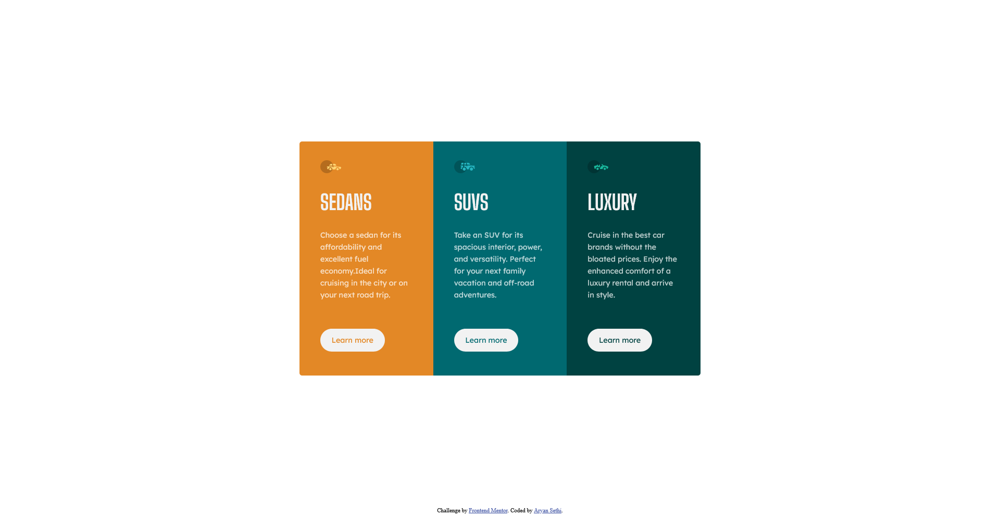

# Frontend Mentor - 3-column preview card component solution

This is a solution to the [3-column preview card component challenge on Frontend Mentor](https://www.frontendmentor.io/challenges/3column-preview-card-component-pH92eAR2-). Frontend Mentor challenges help you improve your coding skills by building realistic projects. 

## Table of contents

- [Overview](#overview)
  - [The challenge](#the-challenge)
  - [Screenshot](#screenshot)
  - [Links](#links)
- [My process](#my-process)
  - [Built with](#built-with)
  - [What I learned](#what-i-learned)
  - [Continued development](#continued-development)
  - [Useful resources](#useful-resources)
- [Author](#author)

## Overview

### The challenge

Users should be able to:

- View the optimal layout depending on their device's screen size
- See hover states for interactive elements

### Screenshot

### Links

- Solution URL: [Index html file](./index.html)
- Live Site URL: [3 Column Preview Card](https://aryan-ki-codepanti.github.io/3-column-preview-card-component/)

## My process

### Built with

- Semantic HTML5 markup
- CSS custom properties
- CSS Grid

### Continued development

For future i would like to focus on improving my CSS skills like responsiveness and play about box shadows 

### Useful resources

- [MDN dev docs](https://developer.mozilla.org/) - This helped me for tricks and tips and short lookups for CSS and Javascript.
- [Kevin Powell youtube channel](https://www.youtube.com/kepowob) - This helped me  understanding concepts of flexbox and box-shadows in CSS.

## Author

- Frontend Mentor - [@Aryan-ki-codepanti](https://www.frontendmentor.io/profile/Aryan-ki-codepanti)
- Twitter - [@AryanSe73817078](https://www.twitter.com/AryanSe73817078)
- Youtube - [Channel: Coding Tiger](https://www.youtube.com/channel/UCkz7TnVuNBGEQOTa77lmZfA)

